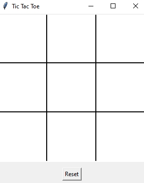
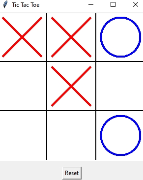
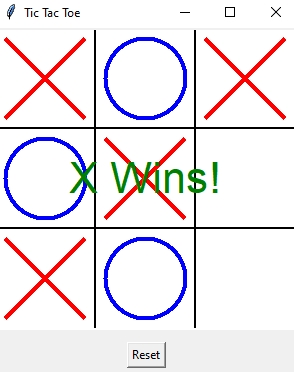

# Tic Tac Toe Game

A simple Tic Tac Toe game built using Python and Tkinter. Play against a friend, with a clean interface and a reset feature to restart the game at any time.

## Features

- **Interactive Gameplay**: 
  - Play a two-player Tic Tac Toe game (Player X vs Player O).
  - Easy-to-use interface with a grid and clickable cells.
- **Winning Logic**:
  - Automatically detects and announces the winner or a draw.
- **Reset Game**:
  - Restart the game anytime using the reset button without closing the application.

## How to Play

1. Launch the application.
2. Player X starts first. Click on any cell to place the symbol.
3. Players take turns placing their symbols (X and O) on the grid.
4. The game ends when one player gets three in a row (horizontally, vertically, or diagonally) or when all cells are filled.
5. Click the **Reset** button to clear the board and start a new game.

## Screenshots

### Main

### Gameplay

### Winning Screen

